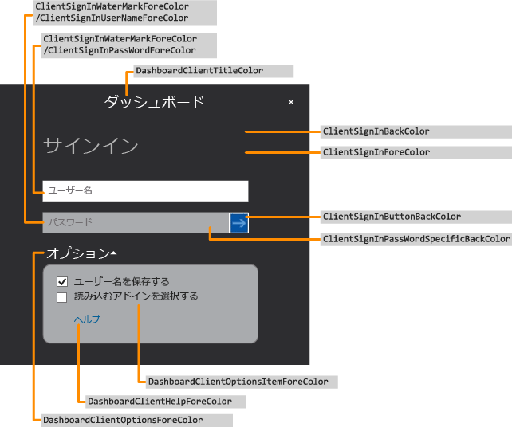
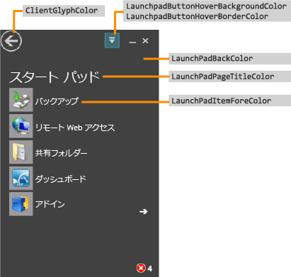
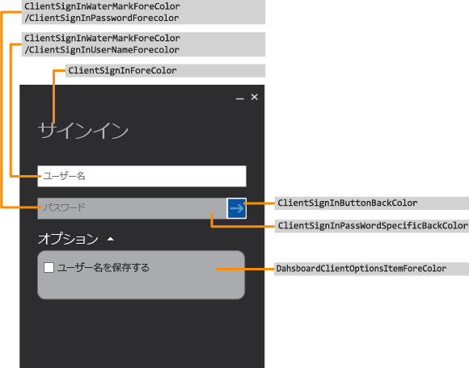
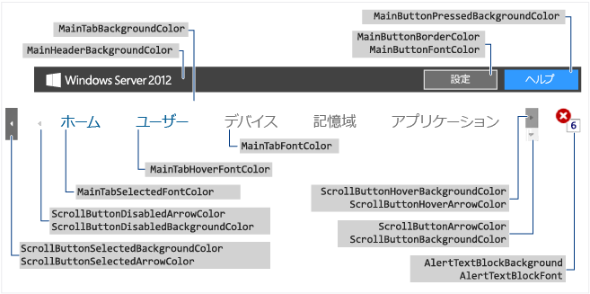
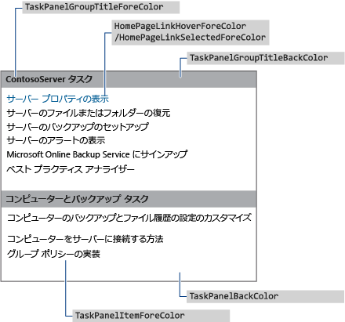
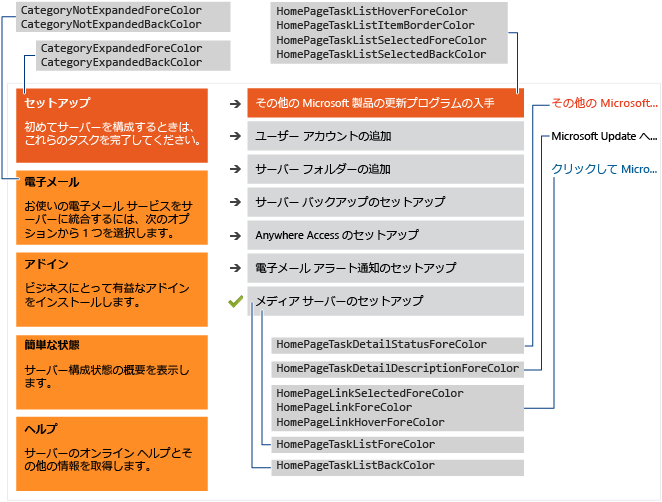

# <a name="change-the-color-scheme-of-the-dashboard-and-launchpad"></a>ダッシュ ボードとスタート パッドの配色を変更します。

>Windows Server 2016 Essentials、Windows Server 2012 R2 Essentials での Windows Server 2012 Essentials を適用対象:

XML で使用する色を定義することで、スタート パッド形式のファイル、レジストリ エントリに .xml ファイルの名前を指定することによって、サーバーでフォルダーに .xml ファイルをインストールして、ダッシュ ボードの配色を変更できます。  
  
## <a name="create-the-xml-file"></a>Xml ファイルを作成します。  
 次の例は、.xml ファイルの内容を示しています。  
  
```xml  
<DashboardTheme xmlns="https://www.microsoft.com/HSBS/Dashboard/Branding/2010">  
  
  <!-- Hex color values overwriting default SKU theme colors -->  
  
    <SplashScreenBackgroundColor HexValue="FFFFFFFF"/>  
    <SplashScreenBorderColor HexValue="FF000000"/>  
    <MainHeaderBackgroundColor HexValue="FF414141"/>  
    <MainTabBackgroundColor HexValue="FFFFFFFF"/>  
    <MainTabFontColor HexValue="FF999999"/>  
    <MainTabHoverFontColor HexValue="FF0072BC"/>  
    <MainTabSelectedFontColor HexValue="FF0072BC"/>  
    <MainButtonPressedBackgroundColor HexValue="FF0072BC"/>  
    <MainButtonFontColor HexValue="FFFFFFFF"/>  
    <MainButtonBorderColor HexValue="FF6E6E6E"/>  
    <ScrollButtonBackgroundColor HexValue="FFF0F0F0"/>  
    <ScrollButtonArrowColor HexValue="FF999999"/>  
    <ScrollButtonHoverBackgroundColor HexValue="FF999999"/>  
    <ScrollButtonHoverArrowColor HexValue="FF6E6E6E"/>  
    <ScrollButtonSelectedBackgroundColor HexValue="FF6E6E6E"/>  
    <ScrollButtonSelectedArrowColor HexValue="FFFFFFFF"/>  
    <ScrollButtonDisabledBackgroundColor HexValue="FFF8F8F8"/>  
    <ScrollButtonDisabledArrowColor HexValue="FFCCCCCC"/>  
    <AlertTextBlockBackground HexValue="FFFFFFFF"/>  
    <AlertTextBlockFont HexValue="FF000000"/>  
    <FontColor HexValue="FF000000"/>  
    <SubTabBarBackgroundColor HexValue="FFFFFFFF"/>  
    <SubTabBackgroundColor HexValue="FFFFFFFF"/>  
    <SubTabSelectedBackgroundColor HexValue="FF414141"/>  
    <SubTabBorderColor HexValue="FF787878"/>  
    <SubTabFontColor HexValue="FF787878"/>  
    <SubTabHoverFontColor HexValue="FF0072BC"/>  
    <SubTabPressedFontColor HexValue="FFFFFFFF"/>  
    <ListViewColor HexValue="FFFFFFFF"/>  
    <PageBorderColor HexValue="FF999999"/>      
    <LaunchpadButtonHoverBorderColor HexValue="FF6BA0B4"/>  
    <LaunchpadButtonHoverBackgroundColor HexValue="FF41788F"/>  
    <ClientArrowColor HexValue="FFFFFFFF"/>  
    <ClientGlyphColor HexValue="FFFFFFFF"/>  
    <SplitterColor HexValue="FF83C6E2"/>  
    <HomePageBackColor     HexValue="FFFFFFFF"/>  
    <CategoryNotExpandedBackColor HexValue="FFFFB343"/>  
    <CategoryExpandedBackColor HexValue="FFF26522"/>  
    <CategoryNotExpandedForeColor HexValue="FF2A2A2A"/>  
    <CategoryExpandedForeColor HexValue="FFFFFFFF"/>  
    <HomePageTaskListForeColor    HexValue="FF2A2A2A"/>  
    <HomePageTaskListBackColor HexValue="FFEAEAEA"/>  
    <HomePageTaskListHoverForeColor      HexValue="FF2A2A2A"/>  
    <HomePageTaskListItemBorderColor     HexValue="FF999999"/>  
    <HomePageTaskListSelectedForeColor   HexValue="FFFFFFFF"/>  
    <HomePageTaskListSelectedBackColor   HexValue="FFF26522"/>  
    <HomePageTaskDetailStatusForeColor   HexValue="FFF26522"/>  
    <HomePageTaskDetailDescriptionForeColor     HexValue="FF2A2A2A"/>  
    <HomePageLinkForeColor HexValue="FF0072BC"/>  
    <HomePageLinkSelectedForeColor HexValue="FF0054A6"/>  
    <HomePageLinkHoverForeColor   HexValue="FF0072BC"/>  
    <PropertyFormForeColor HexValue="FF2A2A2A"/>  
    <PropertyFormTabHoverColor HexValue="FF0072BC"/>  
    <PropertyFormTabSelectedColor HexValue="FFFFFFFF"/>  
    <PropertyFormTabSelectedBackColor HexValue="FF414141"/>  
    <TaskPanelBackColor HexValue="FFFFFFFF"/>  
    <TaskPanelItemForeColor HexValue="FF2A2A2A"/>  
    <TaskPanelGroupTitleForeColor HexValue="FF2A2A2A"/>  
    <TaskPanelGroupTitleBackColor HexValue="FFCCCCCC"/>  
    <DashboardClientBackColor HexValue="FF004050"/>  
    <DashboardClientTitleColor HexValue="FFFFFFFF"/>  
    <DashboardClientOptionsForeColor HexValue="FFFFFFFF"/>  
    <DashboardClientOptionsItemForeColor HexValue="FF2A2A2A"/>  
    <DashboardClientHelpForeColor HexValue="FF0054A6"/>  
    <ClientSignInForeColor HexValue="FFFFFFFF"/>  
    <ClientSignInWaterMarkForeColor HexValue="FF999999"/>  
    <ClientSignInUserNameForeColor HexValue="FF2A2A2A"/>  
    <ClientSignInPassWordSpecificBackColor HexValue="FFCCCCCC"/>  
    <ClientSignInButtonBackColor HexValue="FF004050"/>  
    <ClientSignInPassWordForeColor HexValue="FF2A2A2A"/>  
    <LaunchPadBackColor HexValue="FF004050"/>  
    <LaunchPadPageTitleColor HexValue="FFFFFFFF"/>  
    <LaunchPadItemForeColor HexValue="FFFFFFFF"/>  
  <LaunchPadItemHoverColor HexValue="33FFFFFF"/>  
  <LaunchPadItemIconBackgroundColor HexValue="F2004050"/>  
</DashboardTheme >  
  
```  
  
> [!IMPORTANT]
>  Xml 要素は、前の例に示す順序で指定する必要があります。  
  
> [!NOTE]
>  HexValue 属性のすべての値は、色の 16 進値の例を示します。 使用する任意の 16 進数のカラー値を入力することができます。  
  
 カスタマイズする領域のタグを含む .xml ファイルを作成するのにには、メモ帳や Visual Studio 2010 を使用します。 ファイルには、任意の名前を指定できますが、.xml 拡張子が必要です。 ダッシュ ボードおよびスタート パッドのカスタマイズ可能な領域の説明では、次を参照してください。[変更できるダッシュ ボードとスタート パッドの領域](Change-the-Color-Scheme-of-the-Dashboard-and-Launchpad.md#BKMK_Dashboard)します。  
  
#### <a name="to-install-the-xml-file"></a>.Xml ファイルをインストールするには  
  
1.  サーバーで、マウスを移動して、画面の右上隅とクリックして**検索**します。  
  
2.  検索ボックスに次のように入力します。**regedit**、クリックして、**Regedit**アプリケーション。  
  
3.  左側のウィンドウで [ **HKEY_LOCAL_MACHINE**、展開**ソフトウェア**、展開**Microsoft**、展開**Windows Server**します。 場合、 **OEM**キーが存在しない、作成時に、次の手順を実行する必要があります。  
  
    1.  右クリック**Windows Server**、] をポイント**新規**、] をクリックし、**キー**します。  
  
    2.  種類**OEM**、キーの名前。  
  
4.  右クリック**OEM**、] をポイント**新規**、] をクリックし、**文字列値**します。  
  
5.  Enter **CustomColorScheme**文字列を検索し、キーを押しますの名前として**Enter**します。  
  
6.  右クリック**CustomColorScheme**クリックして、右側のウィンドウで**変更**します。  
  
7.  ファイルの名前を入力し、クリックして**OK**します。  
  
8.  ファイルを %programFiles%\Windows server \bin\oem にコピーします。 OEM ディレクトリが存在しない場合は、それを作成します。  
  
##  <a name="BKMK_Dashboard"></a>変更できるダッシュ ボードとスタート パッドの領域  
 このセクションでは、カスタマイズ可能なダッシュ ボードとスタート パッドの領域の例を示します。  
  
### <a name="examples"></a>例  
  
####  <a name="BKMK_Figure1"></a>ダッシュ ボードのサインイン ページの図 1:  
   
  
####  <a name="BKMK_Figure2"></a>図 2: スタート パッド  
   
  
####  <a name="BKMK_Figure3"></a>スタート パッドのサインイン ページを図 3:  
   
  
####  <a name="BKMK_Figure4"></a>図 4: ダッシュ ボードのテキスト  
   
  
####  <a name="BKMK_Figure5"></a>図 5: サブタブの枠線  
   
  
####  <a name="BKMK_Figure6"></a>図 6: 作業ウィンドウ  
   
  
####  <a name="BKMK_Figure9"></a>図 7 a: 製品のスプラッシュ スクリーン  
   
  
#### <a name="figure-7b-home-page"></a>図 7 b: ホーム ページ  
   
  
## <a name="see-also"></a>参照してください。  
 [作成して、イメージをカスタマイズします。](Creating-and-Customizing-the-Image.md)   
 [追加のカスタマイズ](Additional-Customizations.md)   
 [イメージの展開の準備](Preparing-the-Image-for-Deployment.md)   
 [カスタマー エクスペリエンスのテスト](Testing-the-Customer-Experience.md)